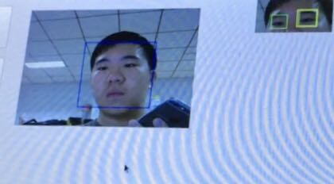

# Opencv_tired_detect1
It used to detect whether a driver is tierd
It use haar detector to detect the face first and to set a ROI, in ROI it detect the right eye and closed eye. By counting 
the percent of closed eyes to detect whether the driver is tired.

